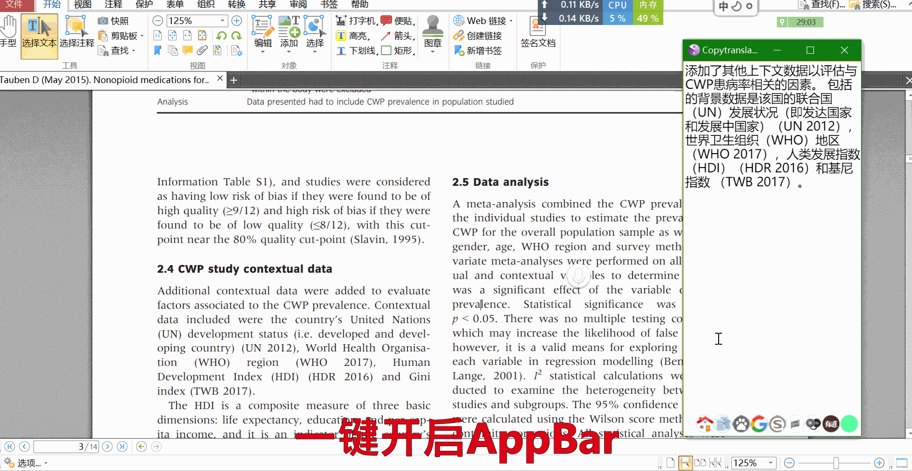

## 介绍

有时需要高频率使用CopyTranslator，置顶会遮挡其他窗口，只能手动排列来避免遮挡，但切换窗口时可能需要需要二次调整，比较繁琐。

CopyTranslatorAppBar脚本，能够利用AppBar，很好的解决这个问题。

> Windows上有个机制叫做AppBar，可以在屏幕上划定区域，让其他窗口自动的避让(任务栏就是通过这个机制实现的)，避免手动操作，从而大幅度提高使用效率。
>

用语言描述起来可能有点困难，你可以下载后使用看看，也可以参考下录屏。

在第1个动画中，因为没有AppBar，为了防止窗口遮挡，需要手动的调整窗口；在第2个动画中，因为右侧被划为AppBar，所有的窗口都自动避开了CopyTranslator。
### 没有AppBar


### 有AppBar


## 用法

手动运行CopyTranslator，并设置为「总是置顶」和「聚焦模式」；运行本程序，并单击图标或按下`Alt+Shift+Z`。

此后再运行时，可以设置自动启用，只需运行本程序即可。

### 路径寻找

程序会首先寻找CopyTranslator.exe的路径，如果在默认安装目录和当前目录中找不到，则需要手动寻找，当然也可以在配置文件中直接写入路径。

### 启用/禁用

单击任务栏图标或者按下快捷键`Alt+Shift+Z`。

## 配置

配置位于当前目录下的`config.json`文件。

默认值如下

```JSON
{"path":"C:\\Users\\YourUserName\\AppData\\Local\\Programs\\copytranslator\\copytranslator.exe","SelfStart":1,"widthRatio":"0.1","winWaitSec":7}
```

### path

CopyTranslator.exe路径。

### selfStart

是否在本程序运行时，自动启用AppBar功能。

### widthRatio

AppBar占据屏幕宽度的比例。

### winWaitSec

当CopyTranslator未运行的时候，会自动运行，这个参数是启动时间的上限，超过则视为拉起失败。